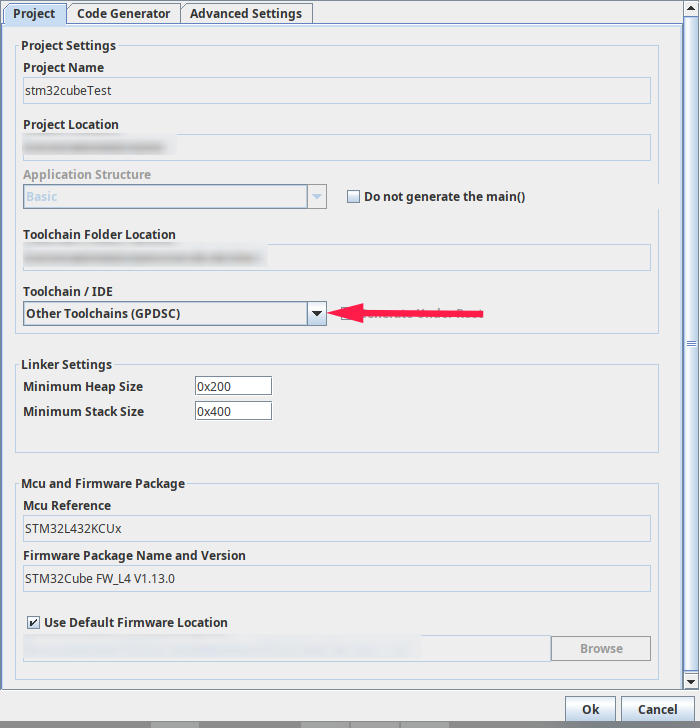

# CubeMxToBazel

Converts STM32CUBEMX Projects to bazel projects. This is acheived by making use of the generated .gpdsc files from stm32cubemx and outputing these in a bazel build file.

This project is in the early developement stage with fairly minimal but well tested functionality.

## Usage

### Installation

Requires a valid [golang](https://github.com/golang/go/wiki/Ubuntu) installation

`go install github.com/silvergasp/CubeMxToBazel`

### Setting up stm32cubemx

Select the "Other Toolchains (GPDSC)" configuration for your project in 'project>settings'.



### Running generator

Running the generator is as simple as changing directories into the project and running the converter

```sh
cd YOUR_PROJECT_PATH_HERE
$GOPATH/bin/CubeMxToBazel
```

The output of this is not neccesarily nice to look at, it is recommended to use bazel auto formatter for this.

```sh
# Install Autoformatter
go install github.com/bazelbuild/buildtools/buildifier
# Run formatter on generated build file
$GOPATH/bin/buildifier BUILD
```

## Current Functionality

- [x] Converts generated `*.gpdsc` files from stm32cubemx into bazel BUILD files
- [ ] Generates bazel WORKSPACE files
- [ ] Generate appropriate bazel compiler flags for; fpu, cpu, hosting specs, optimisations
- [ ] Implement conditional file inclusion (e.g. conditional inclusion of assembly files based on the compiler)
